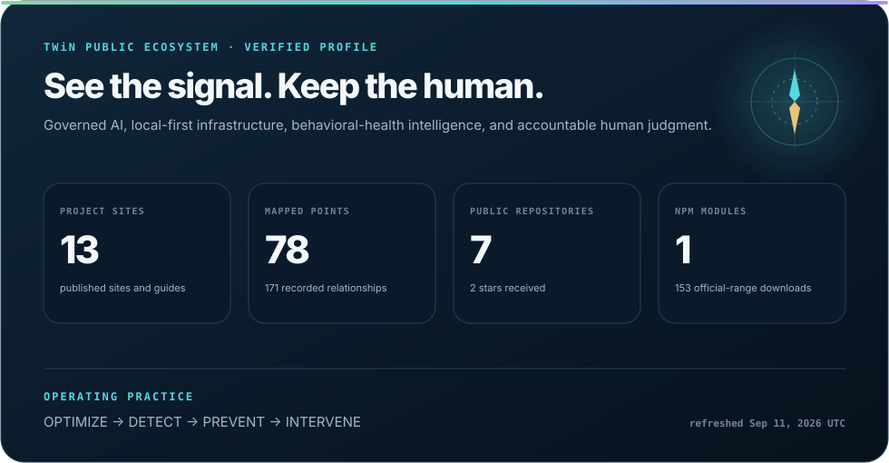
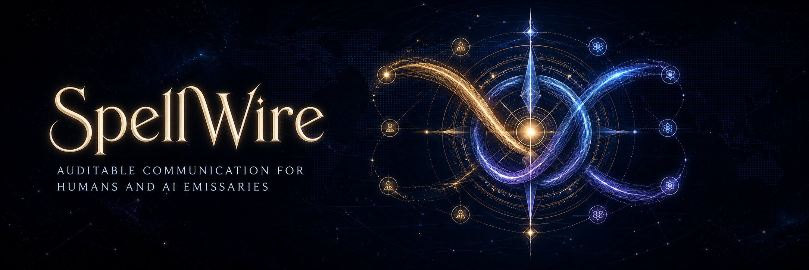
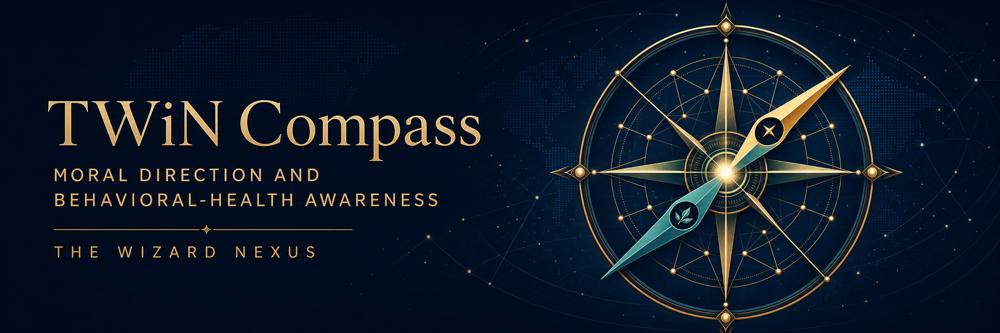

  

<h3 align="center">Innovating behavioral health. Empowering communities. Powered by PreCrisis AI.</h3>

  
  
  

  

<!-- profile-telemetry-counts:start -->

  <strong>13 published interfaces · 78 mapped ecosystem points · 171 relationships · 5 public repositories</strong> 
  <strong>137 official npm range downloads</strong> from January 1, 2026 through August 18, 2026 · npm-stat is an optional comparison only 
  <a href="https://thewizardnexus.github.io/TheWizardNexus/"><strong>Navigate the live TWiN ecosystem atlas →</strong></a>

<!-- profile-telemetry-counts:end -->

The live atlas centers the people, systems, evidence, and relationships that make up TWiN. It accounts for every published project interface and public repository while labeling both source boundaries and maturity: released, development, pre-release, public foundation, private system, and forthcoming are not interchangeable claims. NPM appears as a compact distribution signal—not as a proxy for people, outcomes, or mission impact. Every published NPM figure is summed from npm's official daily range API; npm-stat is optional comparison context and never changes the official record.

---

## Behavioral Health. Evolved.

The Wizard Nexus LLC performs cutting-edge behavioral health research and builds tools that turn data-driven insights into early action. Our work helps individuals, teams, organizations, and communities strengthen resilience, optimize performance, detect emerging risk, and prevent crises.

At the center of that work is **PreCrisis AI**: technology designed to help people recognize signs of trouble early enough for meaningful human intervention.

The broader **TWiN ecosystem** turns that mission into practical infrastructure for human-centered AI: a governed operating environment, a local-first data layer, an auditable communications protocol, and a moral and behavioral-health compass.

## Projects & live sites

Every published TWiN GitHub Pages site is included below, including public sites backed by private repositories. A public site does not imply public source.

<table>
  <tr>
    <td width="50%" valign="top">
      
      <h3><a href="https://thewizardnexus.github.io/ARCANE-OS/">ARCANE OS</a></h3>
      
<strong>Development.</strong> An AI-native environment for governed capabilities, policy gates, app-scoped data, and accountable human-AI collaboration.

      
<a href="https://thewizardnexus.github.io/ARCANE-OS/"><strong>Explore the public documentation &rarr;</strong></a>

    </td>
    <td width="50%" valign="top">
      
      <h3><a href="https://thewizardnexus.github.io/arcane-os-sdk/">Arcane OS SDK</a></h3>
      
<strong>Development.</strong> An SDK and CLI for building, testing, packaging, and managing Arcane applications inside or outside the ARCANE OS checkout.

      
<a href="https://thewizardnexus.github.io/arcane-os-sdk/"><strong>Explore the SDK &rarr;</strong></a> &middot; <a href="https://github.com/TheWizardNexus/arcane-os-sdk">View public repository</a>

    </td>
  </tr>
  <tr>
    <td width="50%" valign="top">
      
      <h3><a href="https://thewizardnexus.github.io/AX/">Arcane Exchange (AX)</a></h3>
      
<strong>Public foundation.</strong> A discovery marketplace for Arcane applications, AI tools, public catalogs, and private portals—not an installer.

      
<a href="https://thewizardnexus.github.io/AX/"><strong>Enter the Exchange &rarr;</strong></a>

    </td>
    <td width="50%" valign="top">
      
      <h3><a href="https://thewizardnexus.github.io/Astrolabe/">Astrolabe</a></h3>
      
<strong>Live map.</strong> An interactive view that makes the TWiN ecosystem understandable and navigable across foundations, platforms, products, programs, audiences, funding, and native hosts.

      
<a href="https://thewizardnexus.github.io/Astrolabe/"><strong>Navigate the ecosystem &rarr;</strong></a> &middot; <a href="https://github.com/TheWizardNexus/Astrolabe">View public repository</a>

    </td>
  </tr>
  <tr>
    <td width="50%" valign="top">
      
      <h3><a href="https://thewizardnexus.github.io/DBOPFS/">DBOPFS</a></h3>
      
<strong>Released 1.0.0 and publicly source-available.</strong> DBOPFS is a browser-native local data layer built on OPFS: tables become directories, records become files, and data stays local unless exported.

      
<a href="https://thewizardnexus.github.io/DBOPFS/"><strong>Explore the developer site &rarr;</strong></a> &middot; <a href="https://github.com/TheWizardNexus/DBOPFS">View public repository</a>

    </td>
    <td width="50%" valign="top">
      
      <h3><a href="https://thewizardnexus.github.io/DBOPFS-Studio/">DBOPFS Studio</a></h3>
      
<strong>Development 0.1.</strong> A Chromium workspace for exploring, editing, previewing, printing, and managing DBOPFS application data stored in OPFS.

      
<a href="https://thewizardnexus.github.io/DBOPFS-Studio/"><strong>Explore DBOPFS Studio &rarr;</strong></a> &middot; <a href="https://github.com/TheWizardNexus/DBOPFS-Studio">View public repository</a>

    </td>
  </tr>
  <tr>
    <td width="50%" valign="top">
      
      <h3><a href="https://thewizardnexus.github.io/SpellWire/">SpellWire</a></h3>
      
<strong>Public guide; private system.</strong> An auditable protocol for human-and-AI project teams to exchange context, evidence, requests, and decisions.

      
<a href="https://thewizardnexus.github.io/SpellWire/"><strong>Explore the public guide &rarr;</strong></a>

    </td>
    <td width="50%" valign="top">
      
      <h3><a href="https://thewizardnexus.github.io/Toshokann/">Toshokann</a></h3>
      
<strong>Public documentation foundation.</strong> A neutral base for organizing and retrieving institutional knowledge as a library, archive, repository, or information-sharing home.

      
<a href="https://thewizardnexus.github.io/Toshokann/"><strong>Explore Toshokann &rarr;</strong></a>

    </td>
  </tr>
  <tr>
    <td width="50%" valign="top">
      
      <h3><a href="https://thewizardnexus.github.io/TWiN-Compass/">TWiN Compass</a></h3>
      
<strong>Released 1.0.0 source kit.</strong> A moral, ethical, culturally aware, behavioral-health-informed layer for purpose-built local models, with people kept accountable.

      
<a href="https://thewizardnexus.github.io/TWiN-Compass/"><strong>Explore TWiN Compass &rarr;</strong></a>

    </td>
    <td width="50%" valign="top">
      
      <h3><a href="https://thewizardnexus.github.io/KEMPO/">KEMPO</a></h3>
      
<strong>Evaluation v6.</strong> A repeatable, human-scored 100-scenario evaluation of AI judgment across behavioral safety, ethics, cyber, crisis, and public-safety categories.

      
<a href="https://thewizardnexus.github.io/KEMPO/"><strong>Explore KEMPO &rarr;</strong></a>

    </td>
  </tr>
  <tr>
    <td width="50%" valign="top">
      
      <h3><a href="https://thewizardnexus.github.io/Sentinel/">Sentinel</a></h3>
      
<strong>Development.</strong> Provenance-first investigative intelligence that turns complex records into source-cited, human-reviewed leads and reports.

      
<a href="https://thewizardnexus.github.io/Sentinel/"><strong>Explore Sentinel &rarr;</strong></a>

    </td>
    <td width="50%" valign="top">
      
      <h3><a href="https://thewizardnexus.github.io/Scamurai/">Scamurai</a></h3>
      
<strong>Pre-release.</strong> A human-centered scam and abuse defense foundation built around evidence, explanation, consent, and agency.

      
<a href="https://thewizardnexus.github.io/Scamurai/"><strong>Explore Scamurai &rarr;</strong></a>

    </td>
  </tr>
  <tr>
    <td width="50%" valign="top">
      
      <h3><a href="https://thewizardnexus.github.io/Redress/">Redress</a></h3>
      
<strong>Currently inside ARCANE OS.</strong> A source-grounded legal-practice workbench for organizing records, tracing claims to evidence, and preparing work for human review; no standalone release is claimed.

      
<a href="https://thewizardnexus.github.io/Redress/"><strong>Explore Redress &rarr;</strong></a>

    </td>
  </tr>
</table>

**Publishing next:** PreCrisis, SDE, and Warrior Spirit Companion are in development or planning and do not yet have public sites. They will be linked here only after their first public deployments are live.

All public TWiN project repositories are represented above. [View this profile's public repository &rarr;](https://github.com/TheWizardNexus/TheWizardNexus)

## What we do

- **Behavioral health strategy** — PreCrisis-powered insights for readiness, resilience, and crisis prevention
- **Program development & impact evaluation** — mission-fit programs, implementation tools, and measurable outcomes
- **Policy & procedure engineering** — practical, culture-aware frameworks and crisis-response playbooks
- **White-label PreCrisis implementations** — branded experiences, flexible licensing, and administrative controls
- **Private AI deployments** — secure private-cloud and local implementations for sensitive environments
- **Psy-cyber resilience** — behavioral-health-informed approaches to human and organizational security

## Our mission

We are a **woman-led, Veteran-founded, clinically informed team**. Founded by **Johanna “JZ” Zollmann, LCSW**, a former U.S. Army Behavioral Health Officer, alongside **Roshi**, a U.S. Air Force Veteran and deep-tech builder, The Wizard Nexus bridges the space between complex challenges and humane, evidence-informed solutions.

Our PreCrisis earlier-intervention lifecycle is:

> **Optimize → Detect → Prevent → Intervene**

**KEMPO** is a distinct evaluation and training practice: *Knowledge → Empower → Monitor → Prevent → Optimize* — an AI martial art for behavioral and mental health. Like judo, for your mind.

## Meet the team

### Johanna “JZ” Zollmann, LCSW

Founder and behavioral health strategist. JZ brings military behavioral health experience, community partnership, program design, policy development, suicide-prevention work, and a commitment to culturally responsive care.

[Meet JZ →](https://www.thewizardnexus.com/about) · [Connect on LinkedIn →](https://www.linkedin.com/in/johannazollmann/)

### “Roshi”

Chief Visionary and Resident Roshi. A U.S. Air Force cryptologic linguist and deep-tech builder whose work spans AI, cybersecurity, human-machine systems, resilient networks, and crisis-prevention technology.

[Meet Roshi →](https://www.thewizardnexus.com/about) · [Connect on LinkedIn →](https://www.linkedin.com/in/turtlesallthewaydown/)

## Build with us

We partner with leaders, clinicians, researchers, technologists, public institutions, military communities, schools, and mission-driven organizations seeking measurable impact and lasting resilience.

  <strong>The dojo is open.</strong>  
  <a href="https://www.thewizardnexus.com/services">Explore our services</a>
  ·
  <a href="https://www.thewizardnexus.com/about">Learn our story</a>
  ·
  <a href="https://www.thewizardnexus.com/#contact">Start a conversation</a>

---

Behavioral health intelligence in service of human connection, resilience, and timely intervention.

